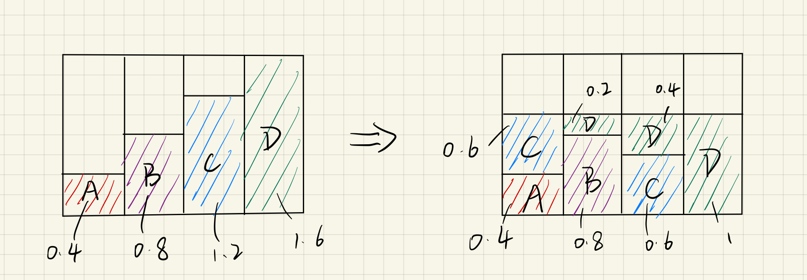
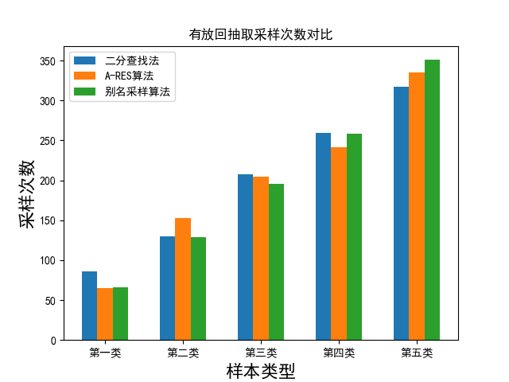
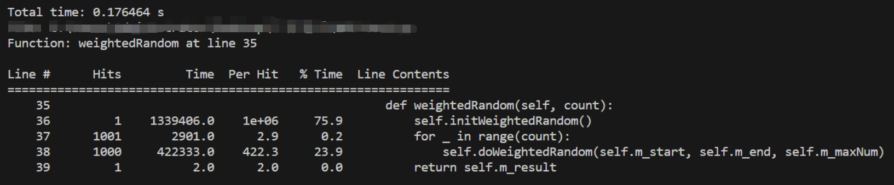
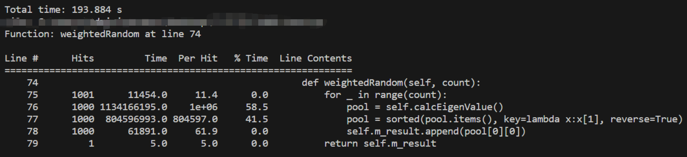
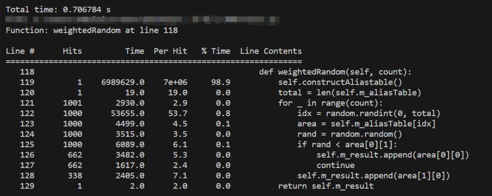
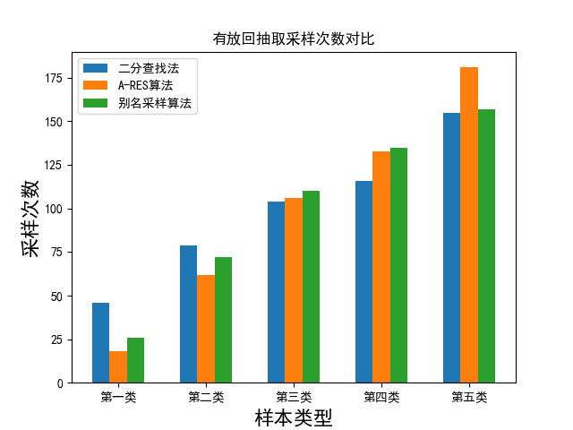
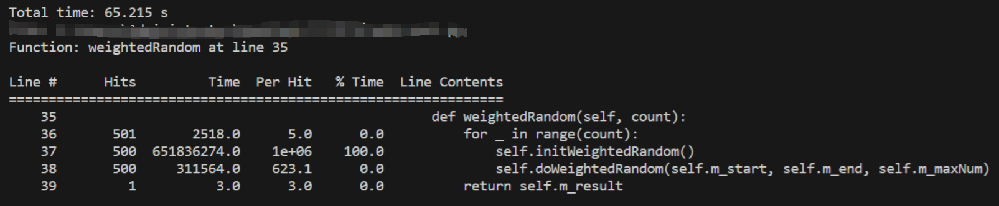
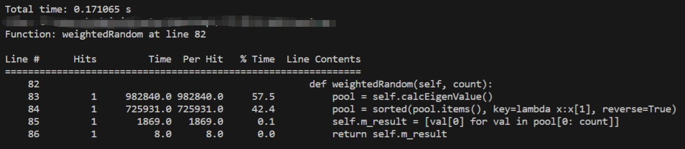
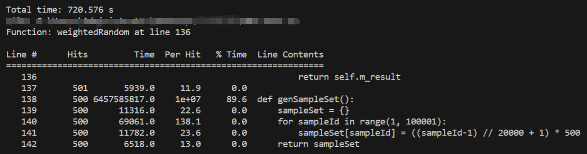

# 2024.03.02 加权随机抽样算法分析

### 问题介绍

    在游戏开发中经常会遇到一个场景，需要以不等概率抽取某些物品（即带权重的随机抽取），如：抽奖、装备洗练等；对应的问题随之而生，在大量抽取的情况下，选择什么方法效率最高？
    其次，随机抽取可以分为有放回抽取和无放回抽取，不同方法在不同的抽取方式下是否有显著的差异？

### 二分查找法

    对于这个问题，最简单的思路是将不同权重的样本ID映射到数组索引上，通过随机生产数组索引返回对应的样本ID，实现加权随机，如```{A:1, B:2, C:3, D:4}```四个样本可以对应构造数组```[A,B,B,C,C,C,D,D,D,D]```，生成一个0~9的随机数，并返回数组中索引对应的样本。但是当样本量增加时，构造数组既费时间也费空间。
    因此，我们可以将构造数组优化成区间段，如上述例子的构造数组优化为区间段后为：```[(0,1), (1,3), (3,6), (6,9)]```，再通过二分查找查找随机数随机数落入哪个区间，并返回对应的样本。

#### 示例代码：以有放回抽取为例

```python
# 二分查找法
class BinarySearchALG():

    def __init__(self, samepleSet):
        self.m_sampleSet = samepleSet
        self.m_result = []
        self.m_edge = 0
        self.m_start = 0
        self.m_end = 0
        self.m_maxNum = 0

    # 初始化二分查找数组
    def initSearchArray(self):
        edge = 0
        searchAarry = []
        for sampleId, weight in self.m_sampleSet.items():
            searchAarry.append([sampleId, range(edge, edge+weight)])
            edge += weight
        return searchAarry

    def initWeightedRandom(self):
        self.m_searchAarry = self.initSearchArray()
        self.m_edge = len(self.m_searchAarry)
        self.m_end = self.m_edge-1
        self.m_maxNum = self.m_searchAarry[-1][1][-1]

    def weightedRandom(self, count):
        self.initWeightedRandom()
        for _ in range(count):
            self.doWeightedRandom(self.m_start, self.m_end, self.m_maxNum)
        return self.m_result

    def doWeightedRandom(self, start, end, maxNum):
        randomNum = random.randint(0, maxNum)
        res = self.bindarySearch(randomNum, start, end)
        self.m_result.append(res)
  
    def bindarySearch(self, target, start, end):
        length = end - start
        mid = length // 2
        idx = mid + start
        weightRange = self.m_searchAarry[idx][1]
        if target in weightRange:
            sampleId = self.m_searchAarry[idx][0]
            return sampleId
        if target > weightRange[-1]:
            return self.bindarySearch(target, idx+1, end)
        return self.bindarySearch(target, start, idx)
```

### A-RES算法

    A-RES算法利用了蓄水池思想来解决大数据的加权随机抽样问题，但是这个方法更适用于一次抽取多个的不放回抽取。具体步骤简化如下：
    假设当前有n个不同权重的样本，需要不放回随机抽取m个
    1、遍历样本数组，生成n个0~1的随机数
    2、计算特征值Ei = R ^ (1/Wi)；其中R为每次生成的随机数，Wi为样本权重，Ei为计算的特征值
    3、对特征值进行排序，前m个即为所求结果

#### 示例代码：以无放回抽取为例

```python
# A-Res算法
class A_RES_ALG():

    def __init__(self, samepleSet):
        self.m_sampleSet = samepleSet
        self.m_result = []

    def calcEigenValue(self):
        pool = {}
        for sampleId, weight in self.m_sampleSet.items():
            eigen = pow(random.random(), 1/weight)
            pool[sampleId] = eigen
        return pool

    def weightedRandom(self, count):
        pool = self.calcEigenValue()
        pool = sorted(pool.items(), key=lambda x:x[1], reverse=True)
        self.m_result = [val[0] for val in pool[0: count]]
        return self.m_result
```

### 别名采样算法

    别名采样算法将一次抽取分成了两个概率分布，分别为样本为n的随机分布和二项分布。具体步骤简化为以下几点：
    假设当前有```{A:1, B:2, C:3, D:4}```四个不同权重的样本
    1、四个样本被抽到的概率为 ```{A:0.1, B:0.2, C:0.3, D:0.4}```
    2、分别将每个样本的概率乘以样本总数，得每个样本的图形面积 ```{```A:0.4, B:0.8, C:1.2, D:1.6}```
    3、将面积大于1的部分补充到小于1的部分，并保证每个单位不超过两个样本，得
```
{
    {A:0.4, C:0.6},
    {B:0.8, D:0.2},
    {C:0.6, D:0.4},
    {D:1}
}
```
    4、随机抽取一个14的整数，并返回对应单位，如：抽到3，返回```{C:0.6, D:0.4}```
    5、随机生成一个01的小数，并返回对应样本，如：抽到0.35，返回样本C
    
    # 计算一下抽到C的总概率：P = 0.25 * 0.6 + 0.25 * 0.6 = 0.3，与1中计算的概率相同

#### 示例代码：以有放回抽取为例

```python
# 别名采样算法
class AliasSamplingALG():
  
    def __init__(self, sampleSet):
        self.m_sampleSet = sampleSet
        self.m_aliasTable = []
        self.m_littleQueue = []  # 存放面积小于1的图形的队列
        self.m_largeQueue = []  # 存放面积大于等于1的图形的队列
        self.m_result = []
        self.initQueue()

    def initQueue(self):
        demon = sum(self.m_sampleSet.values())
        total = len(self.m_sampleSet)
        for sampleId, weight in self.m_sampleSet.items():
            area = weight / demon * total
            if area > 1:
                self.m_largeQueue.append([sampleId, area])
            elif area < 1:
                self.m_littleQueue.append([sampleId, area])
            else:
                self.m_aliasTable.append([[sampleId, area]])

    def constructAliastable(self):
        while self.m_littleQueue and self.m_largeQueue:
            largeInfo = self.m_largeQueue.pop(0)
            littleInfo = self.m_littleQueue.pop(0)
            restArea = largeInfo[1] - (1 - littleInfo[1])
            self.m_aliasTable.append([[largeInfo[0], 1-littleInfo[1]], littleInfo])
            if restArea > 1:
                self.m_largeQueue.append([largeInfo[0], restArea])
            elif restArea < 1:
                self.m_littleQueue.append([largeInfo[0], restArea])
            else:
                self.m_aliasTable.append([[largeInfo[0], restArea]])

    def weightedRandom(self, count):
        for _ in range(count):
            self.constructAliastable()
            total = len(self.m_aliasTable)
            idx = random.randint(0, total)
            area = self.m_aliasTable[idx]
            rand = random.random()
            if rand < area[0][1]:
                self.m_result.append(area[0][0])
                continue
            self.m_result.append(area[1][0])
        return self.m_result
```

# 性能分析

#### 1、有放回抽取

    使用10w个样本，初始权重为500，每2w个样本权重加500，根据不同权重将样本分为五类， 一共抽样1000个

##### 抽样结果：

    

##### 二分查找法时间消耗：

    

##### A-RES算法时间消耗：

    

##### 别名采样算法时间消耗：

    

    可以清楚地看到，在有放回抽取的情况下，二分查找法用时0.17s，别名采样算法用时0.7s，A-RES算法用时高达193.8s；二分查找法和别名采样算法的时间消耗主要集中在构造抽样条件数组上，分别占用了总时间的76%和98.9%；而A-RES算法时间主要消耗在两部分：计算特征值和对本轮特征值进行排序，分别占用58.5%和41.5%，由于A-RES算法每次抽取都要计算全部样本的特征值，因此耗时大大增加了。

#### 2、无放回抽取：

    使用10w个样本，初始权重为500，每2w个样本权重加500，根据不同权重将样本分为五类， 一共抽样500个

##### 抽样结果：

    

##### 二分查找法时间消耗：

    

##### A-RES算法时间消耗：

    

##### 别名采样算法时间消耗：

    

    同样可以看到，在无放回抽取的情况下，由于二分查找法和别名采样算法每次抽取结束后都要剔除掉已抽取的样本重新构造条件数组，用时分别高达65.2s和720.5s；而A-RES算法只需计算一轮特征值，在不放回抽取的情况中具有非常大的优势，用时仅0.17s。

# 总结

    在无放回抽取中，选择A-RES算法可以大大提高抽样的效率；在有放回的情况中，如果样本量大、抽样次数不多，可以选择二分查找法；如果样本量中等，但抽样次数特别多，则可以使用别名采样法。

    测试脚本：WRS/WRS-test.py
